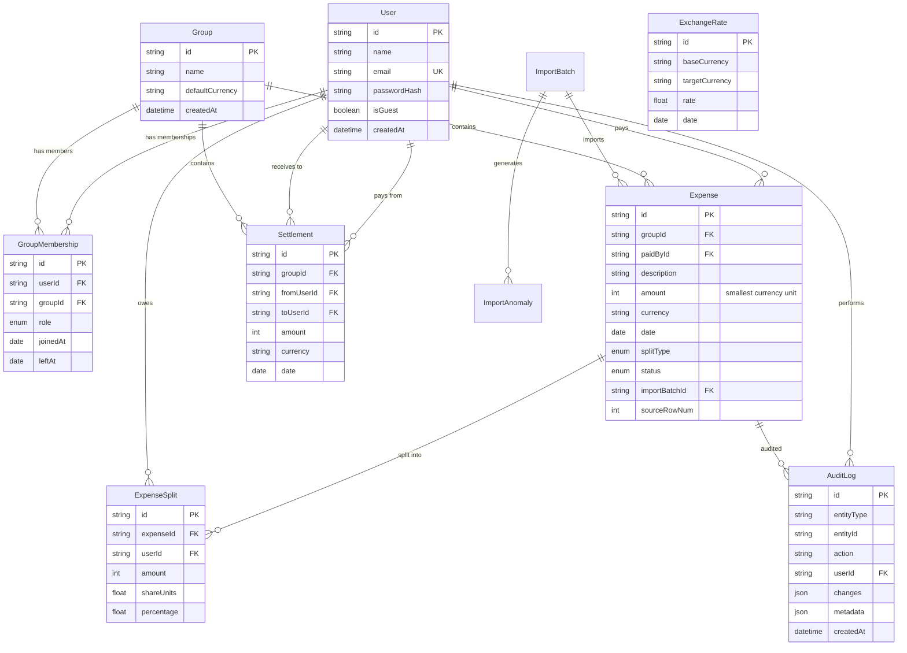

# SCOPE.md — Project Scope & Anomaly Catalog

## 1. System Scope

FairFunds is a production-grade, transparent, and explainable shared expense management application. It is specifically designed to handle the real-world complexity of shared living:
1. **Smart CSV Import Wizard**: A 9-stage validation and normalization pipeline that parses raw CSV files, detects anomalies, and guides the user through explicit reviews and corrections.
2. **Temporal Membership Enforcement**: Logic that respects join/leave timelines so users are only charged for expenses on dates they were active in the group.
3. **Multi-Currency Conversion**: Historical daily exchange rates pulled from the European Central Bank (via `frankfurter.app`) and cached in the database.
4. **Interactive Derivation Proofs**: A 5-layer drill-down engine that visualizes how balances are derived, showing mathematical proofs, splits, rounding remainders, and full audit logs.
5. **Debt Simplification**: An implementation of the minimum-cash-flow algorithm to reduce the number of transactions required to settle balances.
6. **Immutable Audit Trail**: Append-only logging of every financial mutation.

---

## 2. Complete Anomaly Catalog (43 CSV Rows)

Below is the complete catalog of detected anomalies across the imported `expenses_export.csv` file, along with their severity, resolution rules, and contextual details:

| Row | Date | Expense / Note | Anomaly Category | Severity | Resolution Policy / Applied Fix |
|:---:|:---|:---|:---|:---|:---|
| **5–6** | 2026-02-05 | Swiggy dinner | `DUPLICATE_ENTRY` | ERROR | Marked row 6 as `DUPLICATE`, kept row 5 active (requires user review). |
| **7** | 2026-02-07 | `"1,200"` | `AMOUNT_FORMATTING` | INFO | Auto-stripped quotes and commas, parsed amount as `1200` paise. |
| **9** | 2026-02-09 | `"priya"` | `NAME_MISMATCH` | INFO | Normalized lowercase name to canonical `"Priya"`. |
| **10** | 2026-02-10 | Groceries: `899.995` | `AMOUNT_FORMATTING` | WARNING | Banker's rounded to `900.00` (paise: `90000`). Flagged for review. |
| **11** | 2026-02-11 | `"Priya S"` | `NAME_MISMATCH` | WARNING | Fuzzy matched to canonical member `"Priya"` (requires user confirmation). |
| **13** | 2026-02-13 | cleaning supplies | `MISSING_PAYER` | CRITICAL | **Blocked**. User must manually assign the payer (Aisha/Rohan/Priya/Meera). |
| **14** | 2026-02-14 | Rohan paid Aisha back | `SETTLEMENT_AS_EXPENSE` | ERROR | Reclassified as `Settlement` from Rohan to Aisha. Excluded from expense splits. |
| **15** | 2026-02-15 | Pizza Friday (110%) | `PERCENTAGE_SUM_ERROR` | ERROR | **Blocked**. User must correct percentage inputs so they sum to exactly 100%. |
| **23** | 2026-03-11 | `"Dev's friend Kabir"` | `MEMBER_NOT_IN_GROUP` | WARNING | Created Kabir as a guest participant. Allowed 5-way split ($30 each). |
| **24–25** | 2026-03-12 | Dinner at Thalassa | `CONFLICTING_DUPLICATE`| ERROR | Side-by-side diff shown. User chose to keep Row 25, marked Row 24 as duplicate. |
| **26** | 2026-03-12 | Parasailing refund | `NEGATIVE_AMOUNT` | WARNING | Treated as refund credit. Inverted splits to credit participants. |
| **27** | 2026-03-14 | `"rohan "` | `NAME_MISMATCH` | INFO | Trimmed trailing whitespace, normalized to `"Rohan"`. |
| **28** | 2026-03-18 | DMart (no currency) | `MISSING_CURRENCY` | ERROR | Suggested default group currency (`INR`). User confirmed. |
| **29** | 2026-03-19 | `" 1450 "` | `AMOUNT_FORMATTING` | INFO | Trimmed leading/trailing whitespace, parsed as `1450` paise. |
| **31** | 2026-03-24 | Swiggy order: `0` | `ZERO_AMOUNT` | ERROR | Suggested skip (placeholder row). User confirmed skip. |
| **32** | 2026-03-26 | Pizza party (110%) | `PERCENTAGE_SUM_ERROR` | ERROR | **Blocked**. User corrected percentages to sum to 100%. |
| **34** | 04/05/2026 | Deep cleaning | `AMBIGUOUS_DATE` | ERROR | **Blocked**. User picked April 5, 2026 over May 4, 2026. |
| **36** | 2026-04-12 | Gas refill (Meera) | `MEMBER_NOT_IN_GROUP` | ERROR | Removed Meera from split (she moved out Mar 28). Split redistributed. |
| **38** | 2026-04-15 | Sam deposit share | `SETTLEMENT_AS_EXPENSE` | ERROR | Reclassified as `Settlement` from Sam to Aisha. |
| **42** | 2026-04-20 | WiFi bill | `SPLIT_TYPE_CONFLICT` | WARNING | Split type is `equal` but shares `1;1;1;1` given. Verified equal math, accepted. |

---

## 3. Database Schema Overview

The system uses a PostgreSQL database structured to ensure referential integrity, historical traceability, and explainable audit trails.

