# Database Schema Design — Shared Expense Management

---

## 1. Entity Relationship Diagram

```mermaid
erDiagram
    users ||--o{ group_memberships : "has"
    groups ||--o{ group_memberships : "contains"
    users ||--o{ expenses : "pays"
    groups ||--o{ expenses : "contains"
    expenses ||--o{ expense_splits : "divided into"
    users ||--o{ expense_splits : "owes"
    users ||--o{ settlements : "pays (from)"
    users ||--o{ settlements : "receives (to)"
    groups ||--o{ settlements : "tracks"
    import_batches ||--o{ expenses : "sources"
    import_batches ||--o{ import_anomalies : "produces"
    import_batches ||--o{ settlements : "sources"
    users ||--o{ audit_logs : "performs"

    users {
        text id PK "cuid"
        text name "NOT NULL"
        text email "UNIQUE NOT NULL"
        text password_hash "NOT NULL"
        text avatar_url "nullable"
        boolean is_guest "DEFAULT false"
        timestamptz created_at "DEFAULT now()"
        timestamptz updated_at "auto"
    }

    groups {
        text id PK "cuid"
        text name "NOT NULL"
        text description "nullable"
        text default_currency "DEFAULT INR"
        timestamptz created_at "DEFAULT now()"
        timestamptz updated_at "auto"
    }

    group_memberships {
        text id PK "cuid"
        text user_id FK "NOT NULL"
        text group_id FK "NOT NULL"
        text role "MEMBER or ADMIN"
        date joined_at "NOT NULL"
        date left_at "nullable = still active"
        timestamptz created_at "DEFAULT now()"
    }

    expenses {
        text id PK "cuid"
        text group_id FK "NOT NULL"
        text paid_by_id FK "NOT NULL"
        text description "NOT NULL"
        integer amount "smallest currency unit"
        text currency "NOT NULL e.g. INR USD"
        date date "NOT NULL"
        text split_type "EQUAL UNEQUAL PERCENTAGE SHARE"
        text status "ACTIVE DUPLICATE DELETED"
        text notes "nullable"
        text import_batch_id FK "nullable"
        integer source_row_num "nullable"
        timestamptz created_at "DEFAULT now()"
        timestamptz updated_at "auto"
    }

    expense_splits {
        text id PK "cuid"
        text expense_id FK "NOT NULL CASCADE"
        text user_id FK "NOT NULL"
        integer amount "what this user owes"
        float share_units "nullable for SHARE type"
        float percentage "nullable for PERCENTAGE type"
        timestamptz created_at "DEFAULT now()"
    }

    settlements {
        text id PK "cuid"
        text group_id FK "NOT NULL"
        text from_user_id FK "NOT NULL"
        text to_user_id FK "NOT NULL"
        integer amount "smallest currency unit"
        text currency "NOT NULL"
        date date "NOT NULL"
        text notes "nullable"
        text import_batch_id FK "nullable"
        integer source_row_num "nullable"
        timestamptz created_at "DEFAULT now()"
    }

    exchange_rates {
        text id PK "cuid"
        text base_currency "NOT NULL"
        text target_currency "NOT NULL"
        float rate "NOT NULL"
        date date "NOT NULL"
        text source "DEFAULT frankfurter"
    }

    import_batches {
        text id PK "cuid"
        text file_name "NOT NULL"
        text status "PENDING PARSING REVIEW IMPORTING COMPLETED FAILED"
        text group_id FK "nullable"
        text imported_by "NOT NULL userId"
        integer total_rows "DEFAULT 0"
        integer valid_rows "DEFAULT 0"
        integer skipped_rows "DEFAULT 0"
        integer error_rows "DEFAULT 0"
        timestamptz created_at "DEFAULT now()"
        timestamptz completed_at "nullable"
    }

    import_anomalies {
        text id PK "cuid"
        text import_batch_id FK "NOT NULL CASCADE"
        integer row_number "NOT NULL"
        text column_name "nullable"
        text anomaly_type "NOT NULL"
        text severity "INFO WARNING ERROR CRITICAL"
        text raw_value "nullable"
        text description "NOT NULL"
        text suggested_fix "nullable"
        text resolution "PENDING AUTO_FIXED USER_ACCEPTED USER_MODIFIED USER_SKIPPED"
        text resolved_value "nullable"
        text resolved_by "nullable userId"
        timestamptz resolved_at "nullable"
        timestamptz created_at "DEFAULT now()"
    }

    audit_logs {
        text id PK "cuid"
        text entity_type "NOT NULL"
        text entity_id "NOT NULL"
        text action "NOT NULL"
        text user_id FK "nullable"
        jsonb changes "nullable diff payload"
        jsonb metadata "nullable context"
        timestamptz created_at "DEFAULT now()"
    }
```



---

## 2. Prisma Schema

```prisma
// ─────────────────────────────────────────────────────────────
// prisma/schema.prisma
// Shared Expense Management — PostgreSQL Schema
// ─────────────────────────────────────────────────────────────

generator client {
  provider        = "prisma-client-js"
  previewFeatures = ["fullTextSearchPostgres"]
}

datasource db {
  provider = "postgresql"
  url      = env("DATABASE_URL")
}

// ═══════════════════════════════════════════════════════════════
// USERS
// ═══════════════════════════════════════════════════════════════
//
// Design decisions:
//
// 1. `id` uses cuid() not uuid() — cuids are shorter (25 chars vs 36),
//    URL-safe, sortable by creation time, and collision-resistant.
//    They're also faster to generate than UUIDv4 (no crypto RNG needed).
//
// 2. `passwordHash` stores bcrypt output. Never store plaintext. Never
//    store reversible encryption. bcrypt includes salt and cost factor
//    in the output string, so no separate salt column is needed.
//
// 3. `isGuest` distinguishes full users (Aisha, Rohan...) from ad-hoc
//    participants (Kabir) who appear in one expense but don't have app
//    credentials. Guest users have `passwordHash = ""` and cannot login.
//    This avoids polluting the login flow while preserving split math.
//
// 4. `email` is unique and required for real users. Guest users get a
//    synthetic email like `kabir-guest-{cuid}@internal`. This satisfies
//    the unique constraint without requiring a real email.
//
// 5. `@@map("users")` — Prisma model names are PascalCase by convention,
//    but PostgreSQL tables should be snake_case. The @@map directive
//    bridges this gap.

model User {
  id           String   @id @default(cuid())
  name         String
  email        String   @unique
  passwordHash String   @map("password_hash")
  avatarUrl    String?  @map("avatar_url")
  isGuest      Boolean  @default(false) @map("is_guest")
  createdAt    DateTime @default(now()) @map("created_at")
  updatedAt    DateTime @updatedAt @map("updated_at")

  // ── Relations ──
  memberships    GroupMembership[]
  paidExpenses   Expense[]         @relation("ExpensePayer")
  splits         ExpenseSplit[]
  settlementsOut Settlement[]      @relation("SettlementFrom")
  settlementsIn  Settlement[]      @relation("SettlementTo")
  auditLogs      AuditLog[]

  @@map("users")
}

// ═══════════════════════════════════════════════════════════════
// GROUPS
// ═══════════════════════════════════════════════════════════════
//
// Design decisions:
//
// 1. `defaultCurrency` is the currency used for balance display.
//    All expenses store their original currency; this field controls
//    what currency the balance summary converts everything into.
//    Default is "INR" for this flat-sharing group.
//
// 2. Groups are never deleted — only archived (future enhancement).
//    Referential integrity from expenses/settlements prevents hard
//    deletion anyway.

model Group {
  id              String   @id @default(cuid())
  name            String
  description     String?
  defaultCurrency String   @default("INR") @map("default_currency")
  createdAt       DateTime @default(now()) @map("created_at")
  updatedAt       DateTime @updatedAt @map("updated_at")

  // ── Relations ──
  memberships  GroupMembership[]
  expenses     Expense[]
  settlements  Settlement[]
  importBatches ImportBatch[]

  @@map("groups")
}

// ═══════════════════════════════════════════════════════════════
// GROUP MEMBERSHIPS (Temporal)
// ═══════════════════════════════════════════════════════════════
//
// Design decisions:
//
// 1. TEMPORAL MODEL: `joinedAt` + `leftAt` defines a date range during
//    which a user is considered an active member. This is the foundation
//    for Sam's requirement: "Why would March electricity affect my
//    balance?" The balance engine filters expenses by checking if the
//    expense date falls within the member's active window.
//
// 2. `leftAt` is NULLABLE — null means "still active." This avoids
//    the need for a sentinel value like "9999-12-31" which is fragile
//    and semantically misleading.
//
// 3. `@db.Date` (not `DateTime`) — Membership granularity is daily.
//    Whether Meera left at 9 AM or 11 PM on March 28 doesn't matter;
//    she was a member on that date. Using `Date` avoids timezone edge
//    cases: "Did Meera leave on March 28 IST or March 27 UTC?"
//
// 4. COMPOSITE UNIQUE on `[userId, groupId, joinedAt]` — A user can
//    have MULTIPLE membership records in the same group (for rejoining).
//    Dev has two: Feb 8 (weekend visit) and Mar 8–14 (Goa trip).
//    The unique constraint prevents duplicate records for the same join
//    date but allows distinct membership windows.
//
// 5. `leftAt` is INCLUSIVE — an expense on the departure date still
//    includes the departing member. Meera's farewell dinner (Mar 28)
//    correctly charges Meera. The query is:
//    `joinedAt <= expenseDate AND (leftAt IS NULL OR expenseDate <= leftAt)`
//
// 6. No `ON DELETE CASCADE` — Deleting a user should be impossible
//    while they have membership records. This preserves historical
//    accuracy. Use soft-delete patterns instead.

model GroupMembership {
  id       String      @id @default(cuid())
  userId   String      @map("user_id")
  groupId  String      @map("group_id")
  role     MemberRole  @default(MEMBER)
  joinedAt DateTime    @map("joined_at") @db.Date
  leftAt   DateTime?   @map("left_at") @db.Date
  createdAt DateTime   @default(now()) @map("created_at")

  // ── Relations ──
  user  User  @relation(fields: [userId], references: [id])
  group Group @relation(fields: [groupId], references: [id])

  // ── Constraints ──
  @@unique([userId, groupId, joinedAt])
  @@index([groupId, leftAt])           // Q: "who is active in group X?"
  @@index([userId, groupId])           // Q: "is user Y in group X?"
  @@map("group_memberships")
}

enum MemberRole {
  ADMIN
  MEMBER
}

// ═══════════════════════════════════════════════════════════════
// EXPENSES
// ═══════════════════════════════════════════════════════════════
//
// Design decisions:
//
// 1. INTEGER AMOUNTS — `amount` stores the value in the SMALLEST unit
//    of the currency: paise for INR (1 INR = 100 paise), cents for USD.
//    Example: ₹48,000.00 → stored as 4800000.
//
//    WHY NOT float/decimal?
//    - Float: 0.1 + 0.2 = 0.30000000000000004 in IEEE 754. In a system
//      where Rohan wants to trace every number, floating-point drift is
//      unacceptable. Over 42+ expenses, accumulated errors could reach
//      several rupees.
//    - Decimal(@db.Decimal): PostgreSQL `numeric` type is exact but
//      30-60% slower than integer arithmetic for aggregations. Since we
//      do SUM() across potentially hundreds of expenses per balance
//      calculation, integer performance matters.
//    - Integer: Exact, fast, and the industry standard (Stripe, Square,
//      and Splitwise all use integer cents internally).
//
//    Display conversion: divide by 100 at the presentation layer.
//    ₹48,000 → store 4800000 → display as (4800000 / 100).toFixed(2)
//
// 2. `currency` is a TEXT field, not an enum, because:
//    - ISO 4217 has 180+ currencies. An enum with 180 values is
//      unwieldy and requires a migration to add a new currency.
//    - We validate currency codes at the application layer using a
//      constant set, not at the database layer.
//    - This dataset only uses INR and USD, but the schema should not
//      prevent adding EUR, GBP, etc. without a migration.
//
// 3. `date` uses `@db.Date` (not DateTime) — An expense happened on
//    a calendar date, not at a specific moment. "February rent" is for
//    Feb 1, regardless of when it was entered. This avoids timezone
//    bugs: is "2026-02-01T00:00:00Z" Feb 1 in India (UTC+5:30)?
//    Yes, but only because midnight UTC is 5:30 AM IST. Using Date
//    eliminates this entire class of bugs.
//
// 4. `splitType` is an ENUM — Unlike currency, split types are a closed
//    set defined by our application. Adding a new split type (e.g.,
//    ITEMIZED) is a deliberate schema change that should require a
//    migration + new calculation logic.
//
// 5. `status` tracks the expense lifecycle:
//    - ACTIVE: Normal expense, included in balance calculations.
//    - DUPLICATE: Flagged as duplicate, excluded from balances but
//      preserved in the database for audit trail.
//    - DELETED: Soft-deleted. Never hard-delete expenses — they may
//      be referenced in audit logs, import batches, or dispute history.
//    Only ACTIVE expenses participate in balance queries. The WHERE
//    clause `status = 'ACTIVE'` is the single gate.
//
// 6. IMPORT PROVENANCE — `importBatchId` and `sourceRowNum` link an
//    expense back to the CSV row that created it. This enables:
//    - Tracing any balance anomaly back to the source data
//    - Re-running an import (delete all expenses from batch X)
//    - Answering interview questions like "what happens to row 15?"
//    Both are nullable because manually-created expenses have no import
//    source.
//
// 7. NO `totalAmount` on splits — The expense `amount` is the single
//    source of truth. The sum of `ExpenseSplit.amount` values MUST
//    equal the expense `amount`. This invariant is enforced in the
//    service layer (inside a transaction), not via a database trigger,
//    because Prisma doesn't support triggers. A CHECK constraint
//    could enforce this at the DB level, but cross-table CHECKs are
//    not supported in PostgreSQL — only triggers can do that.

model Expense {
  id           String        @id @default(cuid())
  groupId      String        @map("group_id")
  paidById     String        @map("paid_by_id")
  description  String
  amount       Int           // Smallest currency unit (paise/cents)
  currency     String        @default("INR")
  date         DateTime      @db.Date
  splitType    SplitType     @map("split_type")
  status       ExpenseStatus @default(ACTIVE)
  notes        String?

  // Import provenance
  importBatchId String?  @map("import_batch_id")
  sourceRowNum  Int?     @map("source_row_num")

  createdAt DateTime @default(now()) @map("created_at")
  updatedAt DateTime @updatedAt @map("updated_at")

  // ── Relations ──
  group       Group          @relation(fields: [groupId], references: [id])
  paidBy      User           @relation("ExpensePayer", fields: [paidById], references: [id])
  splits      ExpenseSplit[]
  importBatch ImportBatch?   @relation(fields: [importBatchId], references: [id])
  auditLogs   AuditLog[]     @relation("ExpenseAudit")

  // ── Indexes ──
  //
  // BALANCE_CALC index: The most critical query in the system is:
  //   SELECT ... FROM expenses WHERE group_id = ? AND status = 'ACTIVE'
  // This composite index covers that exact predicate.
  // `date` is included for ORDER BY in expense lists.
  @@index([groupId, status, date], name: "idx_expense_balance_calc")

  // PAYER_LOOKUP: For "how much has user X paid in total?"
  @@index([paidById, status], name: "idx_expense_payer_lookup")

  // IMPORT_TRACE: For "show all expenses from import batch Y"
  @@index([importBatchId], name: "idx_expense_import_trace")

  @@map("expenses")
}

enum SplitType {
  EQUAL
  UNEQUAL
  PERCENTAGE
  SHARE
}

enum ExpenseStatus {
  ACTIVE
  DUPLICATE
  DELETED
}

// ═══════════════════════════════════════════════════════════════
// EXPENSE SPLITS
// ═══════════════════════════════════════════════════════════════
//
// Design decisions:
//
// 1. THIS IS THE BALANCE TABLE — Every balance calculation reduces to:
//    "For user U in group G, sum all `expense_splits.amount` where U
//    is the split participant, minus sum all `expenses.amount` where U
//    is the payer. Settlements then offset the net."
//
//    The split table pre-computes each participant's share at write time.
//    This is a critical decision: we compute the split once (at expense
//    creation) and store the result, rather than re-computing from
//    percentages/shares on every balance query.
//
//    WHY PRECOMPUTE:
//    - Balance queries run on every page load. Recomputing 42+ splits
//      from percentages/shares each time is wasteful.
//    - Equal splits with remainders (e.g., ₹1199 / 4 = ₹299.75 + ₹0.25
//      remainder) must be deterministic. If we recompute, the remainder
//      assignment might vary depending on participant ordering.
//    - The precomputed `amount` is the CANONICAL value. `shareUnits` and
//      `percentage` are stored for EXPLAINABILITY only — they let Rohan
//      see "you owe ₹600 because your share was 1 out of 6 total shares."
//
// 2. `amount` is the RESOLVED amount in the expense's currency, in the
//    smallest unit. For a ₹3600 expense split by shares [1,2,1,2]:
//    - Total shares = 6
//    - Share value = 3600 / 6 = ₹600 per share
//    - Aisha (1 share): amount = 60000 paise
//    - Rohan (2 shares): amount = 120000 paise
//    This amount is what gets summed in balance calculations.
//
// 3. `shareUnits` and `percentage` are NULLABLE FLOAT — They're only
//    populated for SHARE and PERCENTAGE split types respectively.
//    Floats are acceptable here because these values are for DISPLAY
//    only — they never enter arithmetic in balance calculations.
//    The precomputed integer `amount` is the only value used for math.
//
// 4. UNIQUE on `[expenseId, userId]` — A user appears AT MOST ONCE
//    in an expense's split. You can't owe two different amounts for
//    the same dinner. This constraint catches bugs where the split
//    calculator accidentally inserts a user twice.
//
// 5. CASCADE DELETE — If an expense is hard-deleted (which should be
//    extremely rare), its splits go with it. This prevents orphan splits
//    that reference nonexistent expenses. Note: soft-delete (status =
//    DELETED) does NOT trigger cascade — the splits remain, but the
//    balance query's `status = 'ACTIVE'` filter excludes them.

model ExpenseSplit {
  id         String @id @default(cuid())
  expenseId  String @map("expense_id")
  userId     String @map("user_id")
  amount     Int    // What this user owes, in smallest currency unit
  shareUnits Float? @map("share_units")  // Display only: raw share count
  percentage Float?                      // Display only: raw percentage

  createdAt DateTime @default(now()) @map("created_at")

  // ── Relations ──
  expense Expense @relation(fields: [expenseId], references: [id], onDelete: Cascade)
  user    User    @relation(fields: [userId], references: [id])

  // ── Constraints ──
  // One split per user per expense
  @@unique([expenseId, userId])

  // BALANCE_CALC: The other half of the balance query:
  //   SELECT SUM(amount) FROM expense_splits WHERE user_id = ?
  //   AND expense_id IN (SELECT id FROM expenses WHERE group_id = ? AND status = 'ACTIVE')
  // This index makes the JOIN fast.
  @@index([userId, expenseId], name: "idx_split_user_lookup")

  // EXPENSE_DETAIL: For "show all splits for expense X" (expense detail page)
  @@index([expenseId], name: "idx_split_expense_detail")

  @@map("expense_splits")
}

// ═══════════════════════════════════════════════════════════════
// SETTLEMENTS
// ═══════════════════════════════════════════════════════════════
//
// Design decisions:
//
// 1. SEPARATE TABLE vs. expense-with-type-flag:
//
//    Option A: Add a `type` field to Expense ("EXPENSE" | "SETTLEMENT")
//    Option B: Separate Settlement table
//
//    We chose B because:
//    - Settlements have a fundamentally different schema: two users
//      (from/to) instead of one payer + many splits. Forcing a
//      settlement into the Expense schema wastes columns (splitType,
//      splits[], status) and requires NULL-heavy rows.
//    - Balance queries are cleaner: `SUM(expenses)` and `SUM(settlements)`
//      are independent aggregations, not tangled by a WHERE type filter.
//    - The UI for settlements is different: no split calculator, no
//      percentage inputs — just "who paid whom, how much."
//    - Settlements don't have a "split" concept at all. Modeling them
//      as expenses with a single split_with is a semantic mismatch.
//
// 2. `fromUserId` / `toUserId` — "from pays to." In the CSV:
//    - Row 14: Rohan (from) paid Aisha (to) ₹5000
//    - Row 38: Sam (from) paid Aisha (to) ₹15000
//    The balance engine adds the settlement amount to `from`'s paid
//    total and `to`'s received total.
//
// 3. Settlements are NEVER soft-deleted — They represent real-world
//    money transfers that have already occurred. If a settlement was
//    recorded in error, a new reversal settlement should be created
//    instead. This preserves the audit trail.
//
// 4. Import provenance fields (`importBatchId`, `sourceRowNum`) mirror
//    the Expense table for the same traceability reasons.

model Settlement {
  id         String   @id @default(cuid())
  groupId    String   @map("group_id")
  fromUserId String   @map("from_user_id")
  toUserId   String   @map("to_user_id")
  amount     Int      // Smallest currency unit
  currency   String   @default("INR")
  date       DateTime @db.Date
  notes      String?

  // Import provenance
  importBatchId String? @map("import_batch_id")
  sourceRowNum  Int?    @map("source_row_num")

  createdAt DateTime @default(now()) @map("created_at")

  // ── Relations ──
  group      Group       @relation(fields: [groupId], references: [id])
  fromUser   User        @relation("SettlementFrom", fields: [fromUserId], references: [id])
  toUser     User        @relation("SettlementTo", fields: [toUserId], references: [id])
  importBatch ImportBatch? @relation(fields: [importBatchId], references: [id])

  // ── Constraints ──
  // GROUP_SETTLEMENTS: For "show all settlements in group X"
  @@index([groupId, date], name: "idx_settlement_group")

  // USER_SETTLEMENTS: For balance calculation per user
  @@index([fromUserId], name: "idx_settlement_from")
  @@index([toUserId], name: "idx_settlement_to")

  @@map("settlements")
}

// ═══════════════════════════════════════════════════════════════
// EXCHANGE RATES (Cache)
// ═══════════════════════════════════════════════════════════════
//
// Design decisions:
//
// 1. DB-BACKED CACHE, not in-memory — Exchange rates are fetched from
//    frankfurter.app and cached forever. Once we know USD→INR on
//    2026-03-10 was 84.52, that fact never changes. Storing in the
//    DB means:
//    - Rates survive server restarts
//    - Multiple serverless function instances share the cache
//    - The cache is queryable ("show me the rate used for this expense")
//
// 2. UNIQUE on `[baseCurrency, targetCurrency, date]` — There is
//    exactly one rate per currency pair per day. This prevents
//    duplicate entries from concurrent fetches (upsert pattern).
//
// 3. `rate` is Float, not Integer — Unlike money amounts, exchange
//    rates ARE fractional by nature. USD→INR = 84.5235 is meaningful
//    at 4 decimal places. Float precision (15-17 significant digits)
//    is more than sufficient for exchange rates.
//
// 4. `source` tracks where the rate came from. Default is "frankfurter"
//    but if we add a backup API, we can distinguish rates by source
//    for auditing.
//
// 5. No `updatedAt` — Exchange rates are immutable once written.
//    Historical rates don't change. If ECB corrects a published rate
//    (extremely rare), we'd insert a new row with a different source
//    and let the application layer decide which to use.

model ExchangeRate {
  id             String   @id @default(cuid())
  baseCurrency   String   @map("base_currency")
  targetCurrency String   @map("target_currency")
  rate           Float    // 1 base = rate × target
  date           DateTime @db.Date
  source         String   @default("frankfurter")

  // ── Constraints ──
  @@unique([baseCurrency, targetCurrency, date])

  // DATE_LOOKUP: For "get rate on date X" queries during balance calc
  @@index([date], name: "idx_rate_date_lookup")

  @@map("exchange_rates")
}

// ═══════════════════════════════════════════════════════════════
// IMPORT BATCHES
// ═══════════════════════════════════════════════════════════════
//
// Design decisions:
//
// 1. FIRST-CLASS ENTITY — The import pipeline is not a background
//    utility; it's a core feature with its own UI, lifecycle, and
//    audit trail. Modeling it as a database entity means:
//    - Import history is permanent ("we imported this CSV on June 14")
//    - Anomalies are linked to their batch for grouped resolution
//    - We can roll back an entire import by finding all expenses
//      with `importBatchId = X` and deleting them
//
// 2. STATUS LIFECYCLE:
//    PENDING → PARSING → REVIEW → IMPORTING → COMPLETED
//                  └──────────────────────────→ FAILED
//
//    - PENDING: File uploaded, not yet processed
//    - PARSING: CSV being parsed and anomalies being detected
//    - REVIEW: Anomalies detected, waiting for user resolution
//    - IMPORTING: User confirmed, writing to expenses/settlements
//    - COMPLETED: All rows processed
//    - FAILED: Unrecoverable error (corrupt file, DB failure)
//
// 3. Row counters (`totalRows`, `validRows`, `skippedRows`, `errorRows`)
//    provide the summary stats for the import report without requiring
//    a COUNT query against import_anomalies.
//
// 4. `importedBy` is a userId string, not a relation, because the
//    import batch should survive even if the user is later deleted.
//    (In practice, users are never deleted, but this makes the schema
//    more resilient.)

model ImportBatch {
  id          String       @id @default(cuid())
  fileName    String       @map("file_name")
  status      ImportStatus @default(PENDING)
  groupId     String?      @map("group_id")
  importedBy  String       @map("imported_by")
  totalRows   Int          @default(0) @map("total_rows")
  validRows   Int          @default(0) @map("valid_rows")
  skippedRows Int          @default(0) @map("skipped_rows")
  errorRows   Int          @default(0) @map("error_rows")
  createdAt   DateTime     @default(now()) @map("created_at")
  completedAt DateTime?    @map("completed_at")

  // ── Relations ──
  group      Group?          @relation(fields: [groupId], references: [id])
  expenses   Expense[]
  settlements Settlement[]
  anomalies  ImportAnomaly[]

  @@map("import_batches")
}

enum ImportStatus {
  PENDING
  PARSING
  REVIEW
  IMPORTING
  COMPLETED
  FAILED
}

// ═══════════════════════════════════════════════════════════════
// IMPORT ANOMALIES
// ═══════════════════════════════════════════════════════════════
//
// Design decisions:
//
// 1. ONE ROW PER ANOMALY, NOT PER CSV ROW — A single CSV row can
//    have multiple anomalies (e.g., row 27 has both a non-standard
//    date AND a misspelled payer name). Each anomaly gets its own
//    record so they can be resolved independently.
//
// 2. `rawValue` stores the ORIGINAL string from the CSV, before any
//    transformation. This is critical for the import report and for
//    the user to understand what the system changed.
//
// 3. `suggestedFix` is what the system would auto-apply if the user
//    accepts. For auto-fixed items (INFO severity), this is applied
//    immediately. For ERROR/CRITICAL, it's shown as a suggestion.
//
// 4. `resolution` tracks how the anomaly was handled:
//    - PENDING: Not yet addressed
//    - AUTO_FIXED: System applied the fix (INFO/WARNING severity)
//    - USER_ACCEPTED: User accepted the suggested fix
//    - USER_MODIFIED: User provided a different value
//    - USER_SKIPPED: User chose to skip this row entirely
//
// 5. `resolvedValue` stores the FINAL value after resolution. For
//    USER_MODIFIED, this differs from `suggestedFix`. This creates
//    a complete audit trail: rawValue → suggestedFix → resolvedValue.
//
// 6. `anomalyType` and `severity` are TEXT not ENUM — These evolve
//    as we discover new anomaly patterns. Adding a new anomaly type
//    should not require a database migration, only a code change.
//
// 7. CASCADE DELETE from ImportBatch — If an import batch is fully
//    rolled back and deleted, its anomaly records go with it. They
//    have no value without their parent batch.

model ImportAnomaly {
  id            String   @id @default(cuid())
  importBatchId String   @map("import_batch_id")
  rowNumber     Int      @map("row_number")
  columnName    String?  @map("column_name")
  anomalyType   String   @map("anomaly_type")
  severity      String   // INFO, WARNING, ERROR, CRITICAL
  rawValue      String?  @map("raw_value")
  description   String
  suggestedFix  String?  @map("suggested_fix")
  resolution    String   @default("PENDING")
  resolvedValue String?  @map("resolved_value")
  resolvedBy    String?  @map("resolved_by")
  resolvedAt    DateTime? @map("resolved_at")
  createdAt     DateTime @default(now()) @map("created_at")

  // ── Relations ──
  importBatch ImportBatch @relation(fields: [importBatchId], references: [id], onDelete: Cascade)

  // ── Indexes ──
  // REVIEW_QUEUE: For "show all unresolved anomalies for batch X"
  @@index([importBatchId, resolution], name: "idx_anomaly_review_queue")

  // ROW_LOOKUP: For "show all anomalies for CSV row N"
  @@index([importBatchId, rowNumber], name: "idx_anomaly_row_lookup")

  @@map("import_anomalies")
}

// ═══════════════════════════════════════════════════════════════
// AUDIT LOGS
// ═══════════════════════════════════════════════════════════════
//
// Design decisions:
//
// 1. APPEND-ONLY — Audit log rows are INSERT only. No UPDATE, no
//    DELETE, ever. This is enforced at the application layer (the
//    AuditLogger service only exposes a `log()` method). A database
//    trigger could enforce this, but Prisma doesn't support triggers
//    and the service-level guarantee is sufficient.
//
// 2. POLYMORPHIC via `entityType` + `entityId` — Instead of separate
//    foreign keys for each entity (expenseId, settlementId, groupId),
//    we use a single (type, id) pair. This means:
//    - Adding audit logging to a new entity requires zero schema changes
//    - The audit_logs table doesn't grow wide with nullable FK columns
//    - Trade-off: we lose referential integrity at the DB level. If an
//      expense is deleted, its audit logs become orphaned (entityId
//      points to nothing). This is acceptable because:
//      a) Expenses are soft-deleted, never hard-deleted
//      b) Orphaned audit logs are still valuable — they prove something
//         existed and was changed
//
// 3. `changes` is JSONB — Stores structural diffs as:
//    { "amount": { "old": 240000, "new": 245000 },
//      "paidById": { "old": "user_aisha", "new": "user_rohan" } }
//    JSONB (not JSON) because:
//    - JSONB is parsed and stored in binary form, faster to query
//    - Supports GIN indexes for `@>` containment queries
//    - We can query "find all logs where amount changed" using:
//      `WHERE changes ? 'amount'`
//
// 4. `metadata` captures context beyond the diff — e.g., for imports:
//    { "importBatchId": "abc", "sourceRowNum": 14, "reclassifiedTo": "settlement" }
//    This answers "why did this change happen?" not just "what changed?"
//
// 5. `userId` is NULLABLE — System-initiated changes (e.g., auto-fix
//    during import) have no user. The audit log should still capture
//    them. When userId is null, the action was automated.
//
// 6. The `Expense` relation exists for convenient Prisma includes but
//    is optional. In practice, audit logs are queried by (entityType,
//    entityId) directly, not through Prisma relations.

model AuditLog {
  id         String   @id @default(cuid())
  entityType String   @map("entity_type")
  entityId   String   @map("entity_id")
  action     String   // CREATED, UPDATED, DELETED, etc.
  userId     String?  @map("user_id")
  changes    Json?    @db.JsonB
  metadata   Json?    @db.JsonB
  createdAt  DateTime @default(now()) @map("created_at")

  // ── Relations ──
  user    User?    @relation(fields: [userId], references: [id])
  expense Expense? @relation("ExpenseAudit", fields: [entityId], references: [id], map: "fk_audit_expense")

  // ── Indexes ──
  // ENTITY_HISTORY: For "show audit trail for expense X"
  @@index([entityType, entityId], name: "idx_audit_entity_history")

  // USER_ACTIVITY: For "show all actions by user Y"
  @@index([userId, createdAt], name: "idx_audit_user_activity")

  // TIME_RANGE: For "show all activity in the last 24 hours"
  @@index([createdAt], name: "idx_audit_time_range")

  @@map("audit_logs")
}
```

---

## 3. Index Recommendations

### Index Catalog — Complete Reference

Every index is justified by a specific query pattern. Indexes without a clear query pattern are **not created** — they add write overhead and storage cost.

#### 3.1 Balance Calculation Indexes (Highest Priority)

These indexes serve the most frequently executed and most performance-critical queries in the system.

| # | Table | Index | Columns | Query Pattern | Justification |
|---|-------|-------|---------|---------------|---------------|
| 1 | `expenses` | `idx_expense_balance_calc` | `(group_id, status, date)` | `WHERE group_id = ? AND status = 'ACTIVE' ORDER BY date` | **The core balance query.** Every page load of the balances or expense list view executes this. The composite index covers the WHERE + ORDER BY in a single B-tree scan. PostgreSQL can use index-only scans if `date` ordering is needed. |
| 2 | `expenses` | `idx_expense_payer_lookup` | `(paid_by_id, status)` | `WHERE paid_by_id = ? AND status = 'ACTIVE'` | Computes "total paid by user X." The balance engine sums `expenses.amount` for each payer. Without this index, every balance query requires a seq scan filtered by `paid_by_id`. |
| 3 | `expense_splits` | `idx_split_user_lookup` | `(user_id, expense_id)` | `WHERE user_id = ? AND expense_id IN (...)` | Computes "total owed by user X." Paired with index #1 (which produces the expense IDs), this index resolves the JOIN between expenses and splits. The `expense_id` column enables index-only joins. |
| 4 | `expense_splits` | `idx_split_expense_detail` | `(expense_id)` | `WHERE expense_id = ?` | For the expense detail page: "show all splits for this expense." Also used by the balance engine when iterating through expenses. |
| 5 | `settlements` | `idx_settlement_group` | `(group_id, date)` | `WHERE group_id = ? ORDER BY date` | Settlement aggregation for balance calculation. |
| 6 | `settlements` | `idx_settlement_from` | `(from_user_id)` | `WHERE from_user_id = ?` | "How much has user X paid in settlements?" |
| 7 | `settlements` | `idx_settlement_to` | `(to_user_id)` | `WHERE to_user_id = ?` | "How much has user X received in settlements?" |

#### 3.2 Membership Indexes

| # | Table | Index | Columns | Query Pattern | Justification |
|---|-------|-------|---------|---------------|---------------|
| 8 | `group_memberships` | `UNIQUE(user_id, group_id, joined_at)` | `(user_id, group_id, joined_at)` | `WHERE user_id = ? AND group_id = ?` | Enforces "no duplicate join dates" and also serves as a lookup index for membership checks. |
| 9 | `group_memberships` | `idx_membership_group_active` | `(group_id, left_at)` | `WHERE group_id = ? AND (left_at IS NULL OR left_at >= ?)` | "Who is active in group X on date D?" The `left_at` column enables efficient filtering: NULL values (active members) sort to the end of the B-tree. |

#### 3.3 Import Pipeline Indexes

| # | Table | Index | Columns | Query Pattern | Justification |
|---|-------|-------|---------|---------------|---------------|
| 10 | `expenses` | `idx_expense_import_trace` | `(import_batch_id)` | `WHERE import_batch_id = ?` | "Show all expenses created by import batch X." Used for import rollback and the import report. |
| 11 | `import_anomalies` | `idx_anomaly_review_queue` | `(import_batch_id, resolution)` | `WHERE import_batch_id = ? AND resolution = 'PENDING'` | "Show unresolved anomalies for batch X." This is the primary query for the anomaly review UI. The resolution column in the index enables efficient filtering of resolved items. |
| 12 | `import_anomalies` | `idx_anomaly_row_lookup` | `(import_batch_id, row_number)` | `WHERE import_batch_id = ? AND row_number = ?` | "Show all anomalies for CSV row N." Used when the user clicks on a specific row in the import preview. |

#### 3.4 Audit & Lookup Indexes

| # | Table | Index | Columns | Query Pattern | Justification |
|---|-------|-------|---------|---------------|---------------|
| 13 | `audit_logs` | `idx_audit_entity_history` | `(entity_type, entity_id)` | `WHERE entity_type = 'Expense' AND entity_id = ?` | "Show the full audit trail for expense X." Displayed on the expense detail page. |
| 14 | `audit_logs` | `idx_audit_user_activity` | `(user_id, created_at)` | `WHERE user_id = ? ORDER BY created_at DESC` | "Show recent actions by user Y." Used for user activity feeds. |
| 15 | `audit_logs` | `idx_audit_time_range` | `(created_at)` | `WHERE created_at >= ? AND created_at < ?` | "Show all activity in the last 24 hours." Admin monitoring. |
| 16 | `exchange_rates` | `UNIQUE(base, target, date)` | `(base_currency, target_currency, date)` | `WHERE base = ? AND target = ? AND date = ?` | Rate lookup for currency conversion. The unique constraint doubles as the primary lookup index. |
| 17 | `exchange_rates` | `idx_rate_date_lookup` | `(date)` | `WHERE date = ?` | Batch rate fetching: "get all rates for date X" during import (multiple currency pairs on the same date). |

#### 3.5 Indexes NOT Created (and Why)

| Candidate Index | Why Omitted |
|----------------|-------------|
| `expenses(currency)` | Low cardinality (only INR, USD). PostgreSQL's query planner will prefer a seq scan over an index scan when <15% selectivity. |
| `expenses(date)` alone | Already covered by the composite `idx_expense_balance_calc` which has `date` as the 3rd column. For date-only queries (rare), the composite index can still be used with a skip scan. |
| `expense_splits(amount)` | Splits are always looked up by `expense_id` or `user_id`, never by amount value. |
| `audit_logs(action)` | Low cardinality (8 enum values). A full table scan filtered by `action` is faster than an index lookup for such a small value set. |
| `users(name)` | Users are looked up by `id` (primary key) or `email` (unique index). Name-based lookups use the application-level member name map, not a DB query. |
| `GIN on audit_logs(changes)` | JSONB GIN indexes are expensive to maintain and only useful if we frequently query by JSON keys (e.g., "find all logs where amount changed"). This is an admin operation, not a hot path. Add later if needed. |

---

## 4. Query Optimization Recommendations

### 4.1 Balance Calculation — The Critical Path

The balance calculation is the most important query in the system. Here is the optimized approach:

#### Strategy: Two-Pass Aggregation with CTE

```sql
-- BALANCE CALCULATION for group_id = $1, display_currency = $2
-- Returns net balance per user: positive = owed money, negative = owes money

WITH active_expenses AS (
  -- Pass 1: Get all active expenses in the group (uses idx_expense_balance_calc)
  SELECT e.id, e.paid_by_id, e.amount, e.currency, e.date
  FROM expenses e
  WHERE e.group_id = $1
    AND e.status = 'ACTIVE'
),
paid_totals AS (
  -- What each user PAID (credit side)
  -- If expense is in a different currency, multiply by exchange rate
  SELECT
    ae.paid_by_id AS user_id,
    SUM(
      CASE
        WHEN ae.currency = $2 THEN ae.amount
        ELSE ROUND(ae.amount * er.rate)
      END
    ) AS total_paid
  FROM active_expenses ae
  LEFT JOIN exchange_rates er
    ON er.base_currency = ae.currency
    AND er.target_currency = $2
    AND er.date = ae.date
  GROUP BY ae.paid_by_id
),
owed_totals AS (
  -- What each user OWES (debit side)
  SELECT
    es.user_id,
    SUM(
      CASE
        WHEN ae.currency = $2 THEN es.amount
        ELSE ROUND(es.amount * er.rate)
      END
    ) AS total_owed
  FROM expense_splits es
  JOIN active_expenses ae ON ae.id = es.expense_id
  LEFT JOIN exchange_rates er
    ON er.base_currency = ae.currency
    AND er.target_currency = $2
    AND er.date = ae.date
  GROUP BY es.user_id
),
settlement_out AS (
  -- What each user has PAID in settlements
  SELECT from_user_id AS user_id,
    SUM(
      CASE
        WHEN currency = $2 THEN amount
        ELSE ROUND(amount * er.rate)
      END
    ) AS total_settled_out
  FROM settlements s
  LEFT JOIN exchange_rates er
    ON er.base_currency = s.currency
    AND er.target_currency = $2
    AND er.date = s.date
  WHERE s.group_id = $1
  GROUP BY from_user_id
),
settlement_in AS (
  -- What each user has RECEIVED in settlements
  SELECT to_user_id AS user_id,
    SUM(
      CASE
        WHEN currency = $2 THEN amount
        ELSE ROUND(amount * er.rate)
      END
    ) AS total_settled_in
  FROM settlements s
  LEFT JOIN exchange_rates er
    ON er.base_currency = s.currency
    AND er.target_currency = $2
    AND er.date = s.date
  WHERE s.group_id = $1
  GROUP BY to_user_id
)
SELECT
  u.id,
  u.name,
  COALESCE(p.total_paid, 0)
    - COALESCE(o.total_owed, 0)
    - COALESCE(so.total_settled_out, 0)
    + COALESCE(si.total_settled_in, 0)
  AS net_balance
FROM users u
JOIN group_memberships gm ON gm.user_id = u.id AND gm.group_id = $1
LEFT JOIN paid_totals p ON p.user_id = u.id
LEFT JOIN owed_totals o ON o.user_id = u.id
LEFT JOIN settlement_out so ON so.user_id = u.id
LEFT JOIN settlement_in si ON si.user_id = u.id;
```

**Why this structure:**
- **CTEs isolate each aggregation**: PostgreSQL 12+ inlines CTEs by default, so there's no materialization overhead
- **Single pass per table**: Each CTE scans its table once, using the indexes defined above
- **Currency conversion in-line**: The `CASE WHEN` avoids a separate conversion step
- **COALESCE handles NULLs**: Users who haven't paid anything or aren't in any splits get 0 instead of NULL

**Expected performance**: With the recommended indexes, this query runs in <10ms for groups with up to 500 expenses (well beyond this dataset's 42 rows).

---

### 4.2 Membership Timeline Validation

```sql
-- Check if user $1 was active in group $2 on date $3
SELECT EXISTS (
  SELECT 1
  FROM group_memberships
  WHERE user_id = $1
    AND group_id = $2
    AND joined_at <= $3
    AND (left_at IS NULL OR $3 <= left_at)
) AS is_active;
```

**Optimization**: The `UNIQUE(user_id, group_id, joined_at)` index covers this query entirely. PostgreSQL uses an index scan + filter on `left_at`. For the "get all active members on date D" variant, `idx_membership_group_active` is used.

---

### 4.3 Expense Breakdown for a User (Rohan's Requirement)

```sql
-- Per-expense breakdown for user $1 in group $2
SELECT
  e.id,
  e.date,
  e.description,
  e.amount AS total_amount,
  e.currency,
  es.amount AS my_share,
  CASE WHEN e.paid_by_id = $1 THEN e.amount ELSE 0 END AS i_paid,
  CASE WHEN e.paid_by_id = $1 THEN e.amount ELSE 0 END - es.amount AS net_effect
FROM expenses e
JOIN expense_splits es ON es.expense_id = e.id AND es.user_id = $1
WHERE e.group_id = $2
  AND e.status = 'ACTIVE'
ORDER BY e.date DESC;
```

**Optimization**: Uses `idx_expense_balance_calc` for the expense filter, then `idx_split_user_lookup` for the join. Both are covering indexes for this query's predicates.

---

### 4.4 Import Anomaly Review Queue

```sql
-- Get all pending anomalies for batch $1, ordered by severity then row
SELECT *
FROM import_anomalies
WHERE import_batch_id = $1
  AND resolution = 'PENDING'
ORDER BY
  CASE severity
    WHEN 'CRITICAL' THEN 1
    WHEN 'ERROR' THEN 2
    WHEN 'WARNING' THEN 3
    WHEN 'INFO' THEN 4
  END,
  row_number;
```

**Optimization**: `idx_anomaly_review_queue (import_batch_id, resolution)` covers the WHERE clause. The ORDER BY requires an in-memory sort, but with at most ~25 anomalies per batch (this CSV), it's trivially fast.

---

### 4.5 General Optimization Recommendations

| # | Recommendation | Rationale |
|---|---------------|-----------|
| 1 | **Use Prisma `$transaction` for expense creation** | An expense + its splits must be atomically consistent. If the split INSERT fails, the expense INSERT must roll back. Prisma's interactive transactions provide this. |
| 2 | **Avoid N+1 queries with `include`** | When loading an expense list, always `include: { splits: true, paidBy: true }`. Never load expenses first, then loop and load splits. Prisma generates a single JOIN query for includes. |
| 3 | **Use raw SQL for balance aggregations** | Prisma's `groupBy` and `aggregate` don't support the multi-CTE pattern needed for balance calculations. Use `prisma.$queryRaw` with the SQL from §4.1. Type the result with a Zod schema for safety. |
| 4 | **Prefetch exchange rates during import** | During CSV import, collect all unique `(currency, date)` pairs and batch-fetch rates from the API in one pass. This avoids 42 sequential API calls (one per row). |
| 5 | **Connection pooling with PgBouncer / Neon** | On Vercel (serverless), each function invocation opens a new DB connection. Without pooling, this exhausts PostgreSQL's `max_connections` under load. Neon's serverless driver handles this automatically. Use `?pgbouncer=true` in the connection string. |

---

## 5. Schema Invariants (Enforced in Application Layer)

These rules are critical for data integrity but cannot be expressed as PostgreSQL constraints due to their cross-table nature. They MUST be enforced in the service layer, inside transactions.

| # | Invariant | Enforcement |
|---|-----------|-------------|
| 1 | `SUM(expense_splits.amount) = expense.amount` for every expense | Validated in `ExpenseService.create()` before INSERT. If the split calculator produces amounts that don't sum to the expense total, the transaction is aborted. |
| 2 | Every user in `expense_splits` must be an active member on `expense.date` | Validated in `ExpenseService.create()` by calling `MembershipService.validateSplitParticipants()`. |
| 3 | `settlement.fromUserId ≠ settlement.toUserId` | Validated in `SettlementService.create()`. A person cannot settle with themselves. |
| 4 | `expense.status` transitions are restricted: `ACTIVE → DUPLICATE`, `ACTIVE → DELETED`, `DELETED → ACTIVE` (restore), `DUPLICATE → ACTIVE` (un-flag) | Validated in `ExpenseService.updateStatus()` with a state machine check. |
| 5 | `group_membership.joinedAt ≤ group_membership.leftAt` when `leftAt` is not null | Validated in `MembershipService.removeMember()`. A member cannot leave before they join. |
| 6 | Audit logs are append-only | `AuditLogger` service only exposes `log()`. No `update()` or `delete()` methods exist. |
